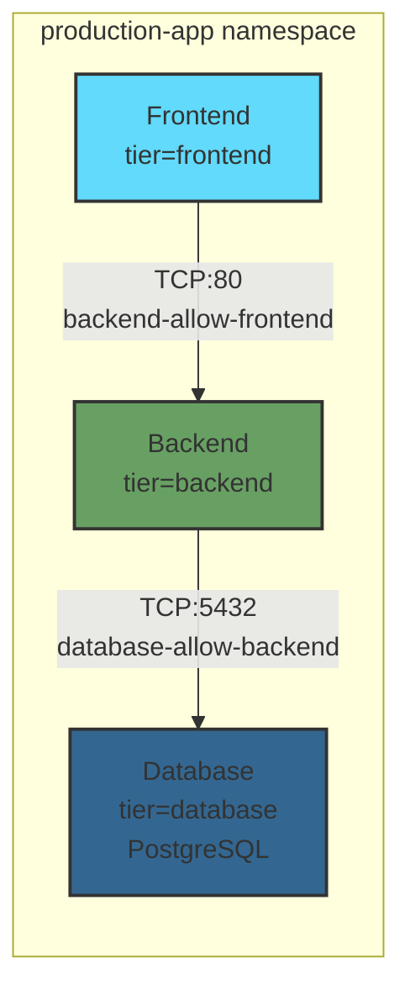

## Creating Network Policies – Ingress Rules

Let’s roll up our sleeves and actually create some Network Policies.  
We’ll walk through a few real-world examples — and I’ll explain each YAML file, line by line, so it all clicks.

---

### Demo Setup  

We'll start with a simple **three-tier app** — frontend, backend, and database.  


**(Instructional tone)**  
Let’s open our terminal and create a new namespace called *production-app*:  

```bash
kubectl create namespace production-app
```

**(Voiceover)**  
Once that's done, let's spin up three pods — one for each tier of the application.  

```bash
kubectl run frontend --image=nginx --labels=tier=frontend -n production-app
kubectl run backend --image=nginx --labels=tier=backend -n production-app
kubectl run database --image=postgres:13 --labels=tier=database -n production-app --env="POSTGRES_DB=myapp" --env="POSTGRES_USER=appuser" --env="POSTGRES_PASSWORD=securepass123"
```

**(Calm pacing)**  
This creates two NGINX pods for frontend and backend, and a PostgreSQL database pod with proper credentials.

Now let's expose these pods as services so they can communicate properly:

```bash
kubectl expose pod frontend --port=80 --target-port=80 -n production-app
kubectl expose pod backend --port=80 --target-port=80 -n production-app
kubectl expose pod database --port=5432 --target-port=5432 -n production-app
```

**(Pause)**  
This creates services for each pod — frontend and backend on port 80, and database on PostgreSQL's standard port 5432.
When you use `kubectl expose pod`, it automatically creates a service with a selector matching the pod's labels.
So the frontend service will select pods with `tier=frontend`, backend with `tier=backend`, and database with `tier=database`.
Right now, all of them can freely talk to each other.  

**(Pause)**  
That’s... not great for security. Let’s lock that down.

---

### Example 1: Default Deny Ingress Policy  

Let’s start with our **first policy** — a *default deny ingress* policy.  
And this time, instead of memorizing YAML, we’ll do it the *exam way* — using the **official Kubernetes documentation**.

**(Instructional tone)**  
Let's open a new browser tab in our Codespaces environment and go to **kubernetes.io**.  
In the search bar, type **"netpol."**

**(Pause)**  
On the right-hand side, under **Default policies**, you’ll see an example titled *Default deny all ingress traffic*.  
Click it, and copy the sample YAML from that page.

**(Encouraging tone)**  
This is an important habit to build for the exam — rather than trying to memorize,  
know **where** to find snippets and how to adapt them quickly.  

Now, back in your terminal, let's paste that into a file called `default-deny-ingress.yaml`.  
It should look like this:

```bash
cat << EOF > default-deny-ingress.yaml
apiVersion: networking.k8s.io/v1
kind: NetworkPolicy
metadata:
  name: default-deny-ingress
  namespace: production-app
spec:
  podSelector: {}
  policyTypes:
  - Ingress
EOF
```

Let’s break this down.

- `apiVersion` — `networking.k8s.io/v1` is stable since Kubernetes 1.7.  
- `metadata` — defines name and namespace; remember, **Network Policies are namespaced**.  
- `podSelector: {}` — those empty braces mean “apply to *all* pods in this namespace.”  
- And `policyTypes: - Ingress` — we’re targeting incoming traffic.

Now — notice there are no `ingress` rules here.  
**No rules means no traffic allowed.** That's our **default deny**.

**(Instructional tone)**  
Alright, let's apply this policy to our cluster using `kubectl apply`:  

```bash
kubectl apply -f default-deny-ingress.yaml
```

**(Voiceover)**  
You should see output saying "networkpolicy/default-deny-ingress created."  

**(Pause for emphasis)**  
So what just happened?  
The Kubernetes API server has now registered this Network Policy object in the `production-app` namespace.  
Behind the scenes, your CNI plugin — in our case, **Calico** — is watching for Network Policy changes.  
When it sees this new policy, it immediately translates it into **iptables rules** on each node where your pods are running.  

**(Calm explanation)**  
These iptables rules act like a firewall at the network layer — blocking all incoming connections to every pod in the namespace.  
This happens **instantly** — there's no restart needed, no pod recreation.  
The moment the policy is applied, all ingress traffic to our frontend, backend, and database pods is now denied.  

**(Pause)**  
One important note — this policy only affects **ingress** traffic.  
Egress — meaning outbound connections *from* the pods — is still completely open.  
We'll cover egress policies in a later clip, but for now, this is exactly what we want.

---

### Example 2: Allow Frontend to Backend  

Next, let’s allow a specific communication path — frontend to backend on port 80.  

**(Voiceover)**  
Create a new file called `backend-allow-frontend.yaml` and paste this in:  

```bash
cat << EOF > backend-allow-frontend.yaml
apiVersion: networking.k8s.io/v1
kind: NetworkPolicy
metadata:
  name: backend-allow-frontend
  namespace: production-app
spec:
  podSelector:
    matchLabels:
      tier: backend
  policyTypes:
  - Ingress
  ingress:
  - from:
    - podSelector:
        matchLabels:
          tier: frontend
    ports:
    - protocol: TCP
      port: 80
EOF
```

**(Calm explanation)**  
Here's what's happening:  

- `podSelector` targets pods labeled `tier=backend`.  
- Under `ingress: from:`, we allow traffic only from pods labeled `tier=frontend`.  
- Since there's no `namespaceSelector`, this applies just within the same namespace.  
- And finally, port 80 for TCP traffic is explicitly allowed.  

**(Instructional tone)**  
Now let's apply this policy:  

```bash
kubectl apply -f backend-allow-frontend.yaml
```

**(Voiceover)**  
You should see "networkpolicy/backend-allow-frontend created" in the output.  

**(Pause)**  
So what's changed now?  
We still have our **default deny** in place — blocking all ingress traffic.  
But we've now added a **specific exception** for the backend pod.  

**(Calm explanation)**  
Kubernetes evaluates Network Policies with an **OR** logic.  
If **any** policy allows the traffic, it goes through.  
So even though the default deny blocks everything, this new policy says:  
"If the source pod has the label `tier=frontend`, and it's trying to reach a pod with `tier=backend` on TCP port 80... allow it."  

**(Pause)**  
Calico immediately updates the iptables rules to permit this specific flow.  
Now the frontend *can* connect to the backend on port 80 — but nothing else can.  
No other pods, no external traffic, not even other ports on the backend — just frontend to backend, port 80, TCP.

---

### Example 3: Allow Backend to Database  

Now we'll connect the backend to the database — port 5432 for PostgreSQL.

**(Voiceover)**  
Create a file named `database-allow-backend.yaml` and add:  

```bash
cat << EOF > database-allow-backend.yaml
apiVersion: networking.k8s.io/v1
kind: NetworkPolicy
metadata:
  name: database-allow-backend
  namespace: production-app
spec:
  podSelector:
    matchLabels:
      tier: database
  policyTypes:
  - Ingress
  ingress:
  - from:
    - podSelector:
        matchLabels:
          tier: backend
    ports:
    - protocol: TCP
      port: 5432
EOF
```

**(Voiceover)**  
Same structure as before, but this time we're targeting the database layer.  
Let's apply this policy:  

```bash
kubectl apply -f database-allow-backend.yaml
```

**(Pause)**  
You'll see "networkpolicy/database-allow-backend created" confirming the policy is active.  

**(Calm explanation)**  
Now we've completed our **layered security model**.  
Let's think about what we've built here:  

**(Pause for clarity)**  
We have **three** Network Policies working together:  
First — the **default deny** blocks all ingress traffic to every pod.  
Second — `backend-allow-frontend` creates an exception allowing frontend to reach backend on port 80.  
Third — `database-allow-backend` creates another exception allowing backend to reach database on port 5432.  

**(Instructional tone)**  
This creates a **unidirectional chain**:  
Frontend can talk to Backend on port 80.  
Backend can talk to Database on port 5432.  
But notice — Frontend cannot directly reach Database. That path is still blocked by the default deny.  
And nothing from outside the namespace can reach any of these pods.  

**(Pause)**  
This is the **principle of least privilege** in action.  
Each tier can only access exactly what it needs — nothing more.  
Everything else is denied by default.

---

### Summary  

Let’s recap what we learned.  

We started by copying a **default deny ingress** policy directly from **kubernetes.io**,  
then gradually opened up specific paths.  
This reflects the **least privilege** model in Kubernetes.  

Key takeaways:  
- `podSelector` defines which pods the policy targets.  
- `policyTypes` tells Kubernetes if it’s controlling ingress, egress, or both.  
- And `ingress` rules specify **who** can connect and **on which ports**.  

That **deny-by-default** mindset is essential — both for **real-world clusters** and for the **CKS exam**.  
And remember — you don't have to memorize YAML.  
Just know how to find and adapt it quickly on **kubernetes.io**.

**(Pause, confident close)**  
Nice work — let's move on.

---

## Network Policy Diagram



**Policy Summary:**
- **Default Deny**: All ingress traffic blocked by default (default-deny-ingress)
- **Frontend → Backend**: Allowed on TCP port 80 (backend-allow-frontend)
- **Backend → Database**: Allowed on TCP port 5432 (database-allow-backend)
- **All other traffic**: Denied

---

**[End of Clip 2]**
